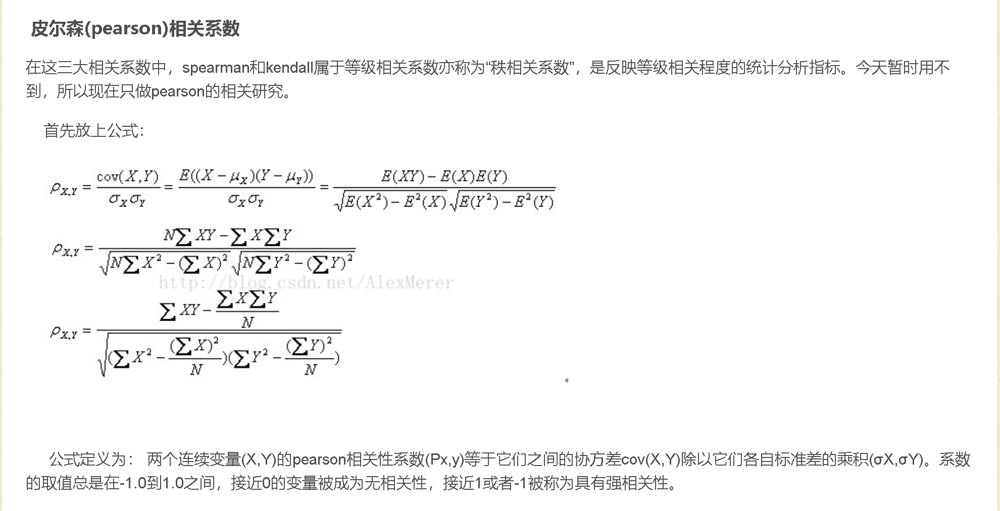
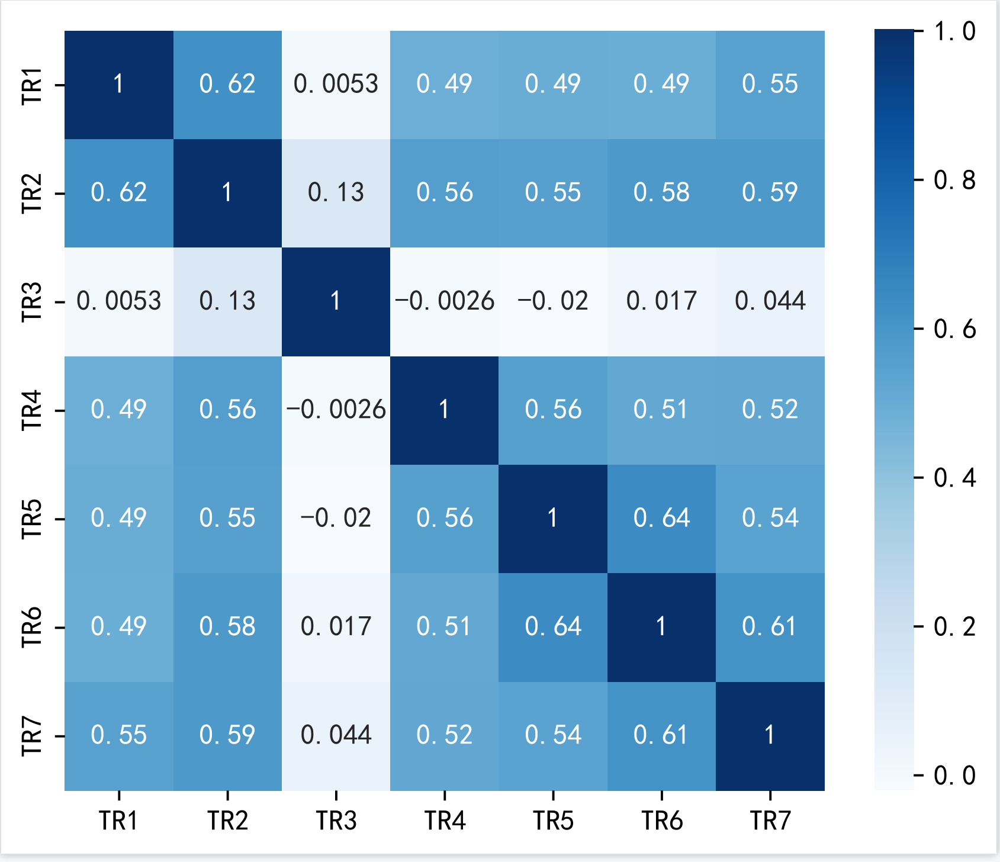
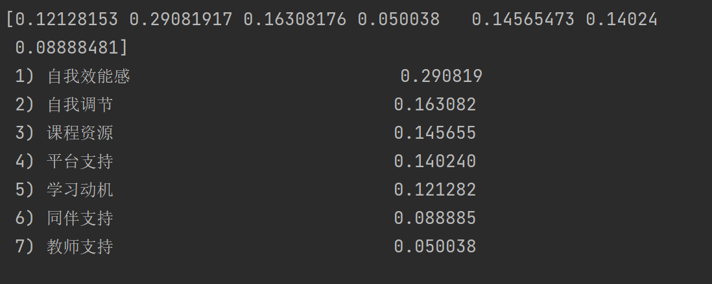

# Transverse-project-MrsW

### 1.文件介绍
md文件是使用说明，py文件是代码，pdf/csv/xlsx/png是结果或者数据，TTF是编码文件不用管

### 2.数据的预处理
就是对分数越高实际表示越不满意的列进行了取反加上6成为最终的值，删去了学习投入这一部分

### 3.相关性分析
#### 3.1 相关性分析缘由
首先我们对影响学习满意度的七个因素（学习动机，自我效能感，自我调节，教师支持，课程资源，平台支持，同伴支持）之间的关系进行了分析，
主要是为了验证对于我们提出的影响学习满意度的这七个因素的合理性的验证（可解释性），同时也能从更广的维度上看出内部因素和外部因素之间的关系，
我们主要从因素相关性这个角度来进行分析，如果因素之间的相关性很低，或者明显有一个因素和其他因素的相关性不高，则说明我们提出的影响因素并不合理
#### 3.2 建模思路
对于影响学习满意度因素的相关性分析，首先我们对每个因素下面的所有细粒度的打分进行求和，然后除以细粒度的个数，得到每个因素的均值（相当于是做了一个归一化）
然后对每个向量用皮尔斯系数计算距离

#### 3.3 结果
结果用热力图进行展示，可以看出影响因素之间基本为相关或者强相关，可以说明我们选取的因素具有较好的可解释性
除此之外，我对满意度的组成（学习自主，学习能力，学习归属）也进行了相关性的分析。基本原理，过程都一样。
#### 3.4 问题和展望
由于存在着相反评分的项，我选取了教师支持因素下的TR1-TR7，我想看一下是否能的出来负相关的含义，但是结果却有两项负相关，与实际认知有差距
，后面可以看一下能否找到负相关的结果。

除此之外，当所有影响因素（最低一维）分析相关性时不太好可视化。

### 4.特征选择
#### 4.1 特征选择缘由
我们想知道这些影响因素和学习满意度之间的关系。哪些影响因素对学习满意度影响较大，哪些影响因素对学习满意度影响较小，问题转化为对特征重要性进行排序。
#### 4.2 建模思路
仍是选取那七个因素，仍然是类似于相关性分析求得均值，对于满意度的体现，我是将总体满意度的三个因素（TS1-TS3）的分数进行了求和。然后将每个同学的七个因素
均值作为输入，总体满意度的求和作为输出，放入机器学习中的随机森林模型中（随机森林可以看作是决策树模型的组合），从随机森林的反馈结果得到特征的重要性排序。
（关于决策树和随机森林有专门的论文，这个原理比较多，我这边就不详细展开了）
#### 4.3 结果
结果放进了excel表格中，内部因素比外部因素更外关键还是比较明显的，关于用什么图可视化展现后面可以再选择

### 5.预测系统（代码写完了，尚在调试）
#### 5.1 搭建预测系统原因
我们可以根据学生当前的外部环境和内部环境，来智能预测出学生当前的学习满意情况，从而可以对学习满意度较低的学生及时地进行帮助。
#### 5.2 建模思路
深度学习（神经网络），输入是每个学生的所有细粒度影响因素的打分，预测结果是满意度。

### 6.going
#### 6.1 发现外部因素对内部因素有影响，从而影响内部因素.
不太明白用什么模型，再查查。
#### 6.2 找出学习成绩情况和满意度之间的统计特征，例如大部分的成绩高的学生满意度都较高，但是仍然有部分学生满意度较低
#### 6.3 新增lightGBM预测模型
#### 6.4 进行项目交接...

